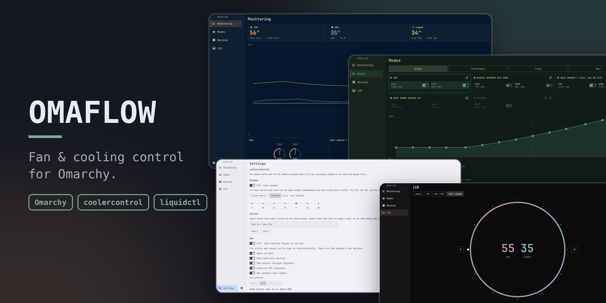
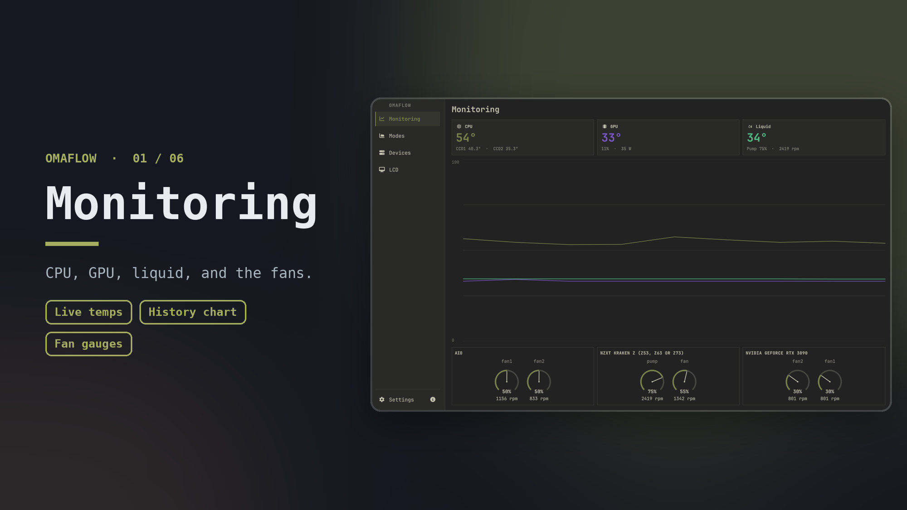
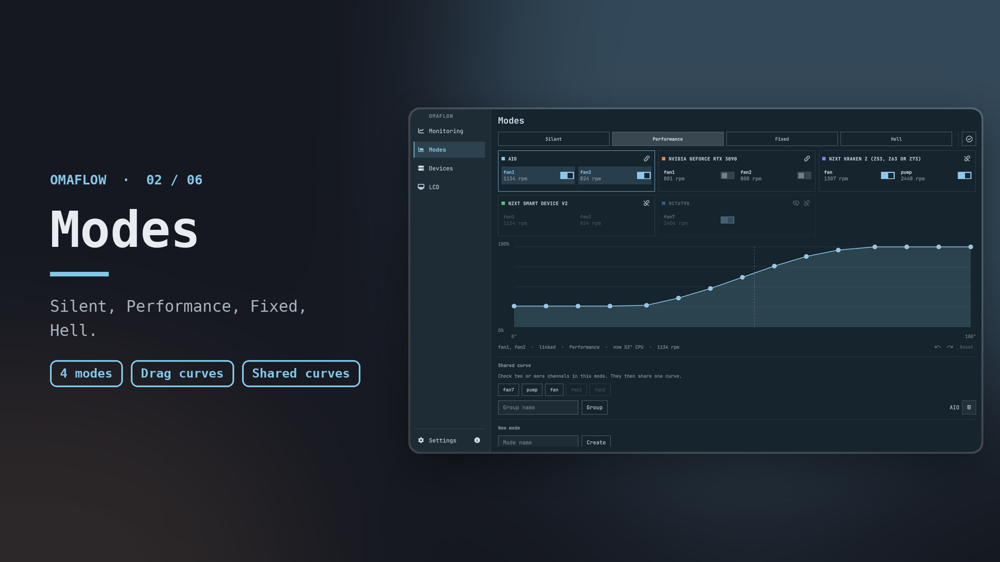
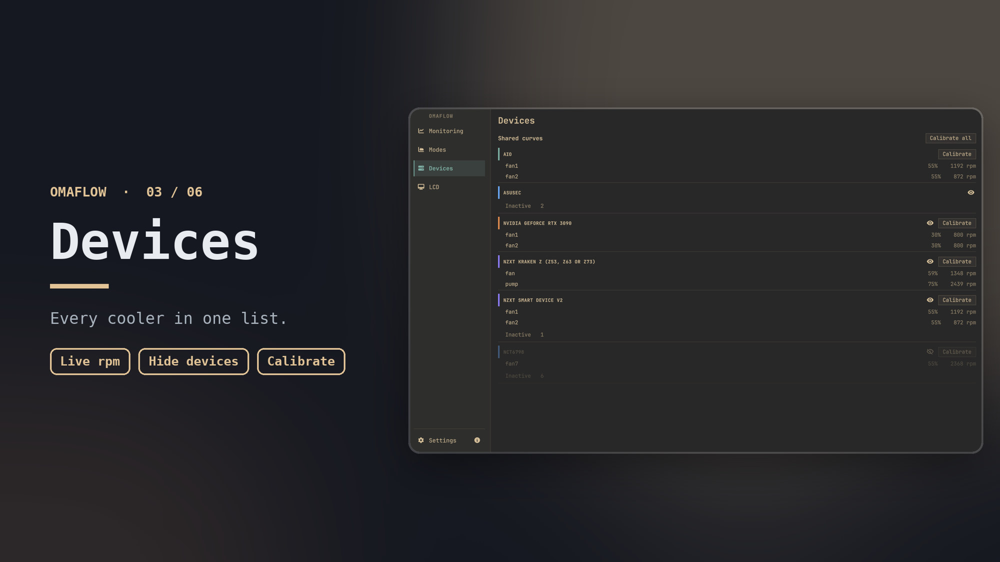
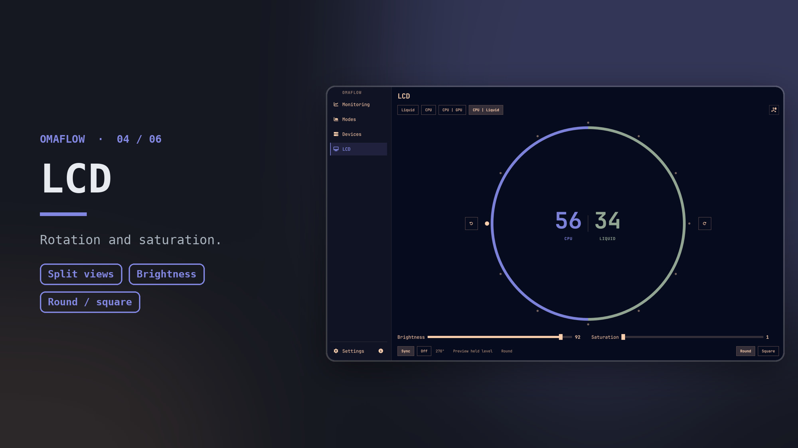
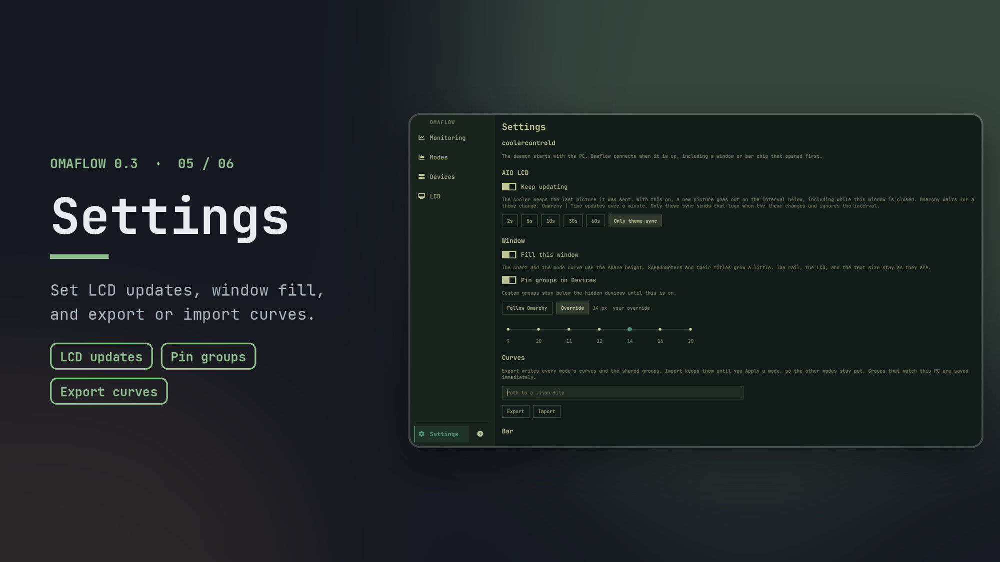
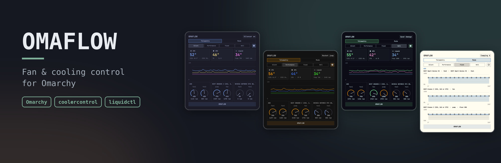

# Omaflow

Omaflow 0.2 is the cooling window and the Omarchy bar chip. Both are clients of [CoolerControl](https://gitlab.com/coolercontrol/coolercontrol)'s `coolercontrold` at `127.0.0.1:11987`. Open the chip and choose **Install coolercontrold** or **Start coolercontrold** after you approve it, or install and start the daemon yourself. **Start with the PC** stays off until you turn it on. Fan writes and sensor polls stay on that daemon's `poll_rate`. Omaflow does not read sysfs, does not run `liquidctl`, does not install the CoolerControl desktop package, and does not store the CoolerControl password.



## Install

### Plugin

The bar chip and the window are this repository. `omarchy plugin add` clones it to:

`~/.config/omarchy/plugins/tempest-chaoscreator.omaflow/`

```bash
omarchy plugin add https://github.com/tempest-chaoscreator/omaflow.git --enable
```

Open the chip. If `coolercontrold` is missing, choose **Install coolercontrold**. That asks for your password and runs `omarchy pkg add coolercontrold`. It does not install the CoolerControl desktop package. If the package is already installed and the service is stopped, choose **Start coolercontrold**. That asks for your password and runs `systemctl start`. It does not enable the service at boot, and Omaflow does not run as root.

To start the daemon with the PC, open Omaflow and turn on **Start with the PC** in Settings. That stays off until you turn it on. The same two steps from a terminal:

```bash
omarchy pkg add coolercontrold
sudo systemctl enable --now coolercontrold
```

Update the installed chip with:

```bash
omarchy plugin update tempest-chaoscreator.omaflow
```

### Git clone

Clone the repository and write the launcher. `./setup` writes:

`~/.local/share/applications/omaflow-standalone.desktop`

Its `Exec` is `<clone>/app/omaflow-standalone`. `./setup` does not install `coolercontrold`, does not enable the daemon, and does not touch the bar. The window offers the same Install and Start buttons as the chip.

```bash
git clone https://github.com/tempest-chaoscreator/omaflow.git
cd omaflow
./setup
./app/omaflow-standalone
```

Install and start the daemon from those buttons, or from a terminal. Install runs `omarchy pkg add coolercontrold` and does not install the CoolerControl desktop package. Start runs `systemctl start` and does not enable the service at boot. **Start with the PC** in Settings stays off until you turn it on.

```bash
omarchy pkg add coolercontrold
sudo systemctl enable --now coolercontrold
```

A saved token at `~/.config/omaflow/coolercontrol.token` (mode `0600`) connects with no prompt. The password is asked once, used to create the token, and dropped. A changed CoolerControl password is left alone. The password and the token are sent only after the listener on `127.0.0.1:11987` is identified as the `coolercontrold` service. If that check fails, nothing is sent. Authenticated requests are not followed across redirects.

When the daemon has no modes, Omaflow creates Silent, Performance, Fixed, and Hell. Each mode gets its own fan curve and its own pump curve. Pump duty stays at or above 50%. Silent is left running. A daemon that already has modes is not rewritten.

### Remove

```bash
omarchy plugin remove tempest-chaoscreator.omaflow
rm -f ~/.local/share/applications/omaflow-standalone.desktop
```

That removes the chip and the window launcher. `coolercontrold` stays installed. The token file stays until you delete `~/.config/omaflow/coolercontrol.token`.

## Dependencies

- Omarchy, for the bar and Quickshell
- `coolercontrold`, not the CoolerControl desktop package
- Python 3, which Omarchy already provides
- `python-pillow`, for the pictures sent to an AIO LCD

## The window



**Monitoring.** Temps, load, and fan speeds. The chart is the last minute. Empty headers that report a duty and 0 rpm stay hidden. GPU fans stay visible at 0 rpm.



**Modes.** Silent, Performance, Fixed, Hell, or a mode you add. A link shares one curve across the fans on that card. The pump keeps its own. Drag a handle to edit. Undo, redo, and Reset sit under the graph. Apply is the check on the right. Choosing a mode does not run it. Apply waits while a fan is being calibrated.



**Devices.** The coolers CoolerControl lists. The eye hides a device from Monitoring and the bar. Calibrate follows the daemon's own sweep, one fan at a time, and does not rewrite saved modes.



**LCD.** The AIO pump display. Round or square follows the cooler. Brightness and saturation sit on the page. Omarchy | Time draws the clock in the theme accent with a 1px black edge. The cooler keeps the last picture it was sent. Settings can keep that picture updating while the window is closed, as long as the bar plugin is enabled.



**Settings.** Fill gives spare height to the graphs. Text size can follow Omarchy or stay at a chosen size. Export and import write `~/Documents/omaflow-curves.json`. The bar switch installs this repository when the chip is missing.

## The bar plugin



Left click opens the chip. Right click toggles Silent and Performance when those modes exist. `1`–`9` select a mode. Apply runs it. `o` opens the window. Escape closes the popover.

## Coolers

Anything `coolercontrold` lists from liquidctl or hwmon. The pump floor is 50% in every mode.

- NZXT Kraken Z, X, and 2023/2024, including an AIO LCD when the device has one
- NZXT Smart Device fan hubs
- Corsair Hydro and Commander hubs that liquidctl exposes
- MSI MEG/MPG CoreLiquid, EVGA and NZXT Asetek 690LC, Aquacomputer D5 Next
- Motherboard PWM headers and NVIDIA GPU fans that CoolerControl exposes

## License

[MIT](LICENSE)
