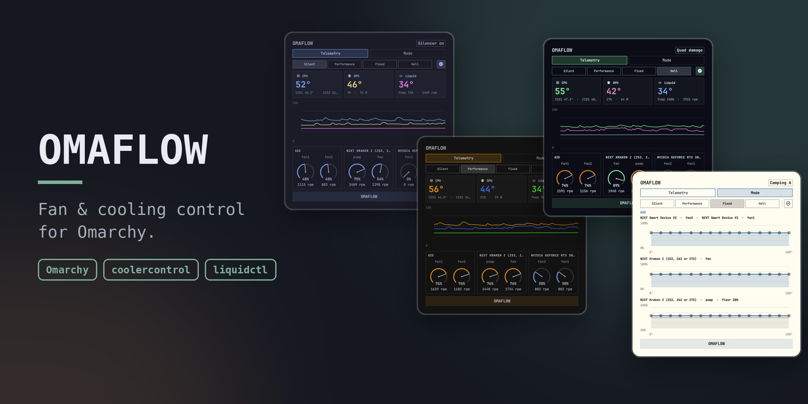
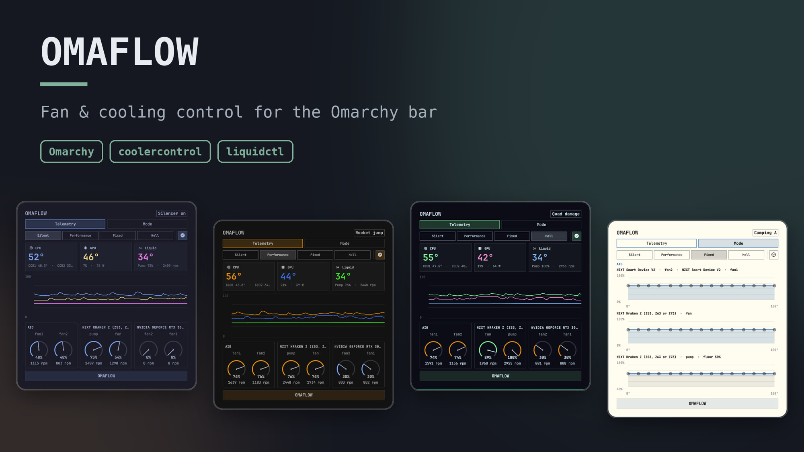

# Omaflow

Omaflow is the cooling window and the Omarchy bar chip. Both are clients of [CoolerControl](https://gitlab.com/coolercontrol/coolercontrol)'s `coolercontrold` at `127.0.0.1:11987`. Fan writes and sensor polls stay on that daemon's `poll_rate`. Omaflow does not read sysfs, does not run `liquidctl`, and does not store the CoolerControl password.

OmaFlow 1.3.0 is no longer maintained. That release used fan2go and a root helper. Do not run fan2go while `coolercontrold` is up. The last 1.3.0 tree is [omaflow-plugin](https://github.com/tempest-chaoscreator/omaflow-plugin) at tag `v1.3.0`.


## Install from nothing

Install `coolercontrold` yourself. Do not install the `coolercontrol` desktop package. Omaflow does not install packages and does not run as root.

```bash
sudo systemctl enable --now coolercontrold
omarchy plugin add https://github.com/tempest-chaoscreator/omaflow.git --enable
```

That clone is the bar chip and the window. Open the chip and press the Omaflow button, or run `./setup` inside the clone. `./setup` writes a desktop launcher whose `Exec` is that clone. It does not enable the daemon.

```bash
git clone https://github.com/tempest-chaoscreator/omaflow.git
cd omaflow
./setup
./app/omaflow-standalone
```

A saved token at `~/.config/omaflow/coolercontrol.token` (mode `0600`) connects with no prompt. The password is asked once, used to create the token, and dropped. A changed CoolerControl password is left alone. The password and the token are sent only after the listener on `127.0.0.1:11987` is identified as the `coolercontrold` service. If that check fails, nothing is sent. Authenticated requests are not followed across redirects.

When the daemon has no modes, Omaflow creates Silent, Performance, Fixed, and Hell. Each mode gets its own fan curve and its own pump curve. Pump duty stays at or above 50%. Silent is left running. A daemon that already has modes is not rewritten.

### Remove

```bash
omarchy plugin remove tempest-chaoscreator.omaflow
```

That removes the chip. `coolercontrold` stays installed. The token file stays until you delete it.

## The window


**Monitoring.** Temps, load, and fan speeds. The chart is the last minute. Empty headers that report a duty and 0 rpm stay hidden. GPU fans stay visible at 0 rpm.


**Modes.** Silent, Performance, Fixed, Hell, or a mode you add. A link shares one curve across the fans on that card. The pump keeps its own. Drag a handle to edit. Undo, redo, and Reset sit under the graph. Apply is the check on the right. Choosing a mode does not run it.


**Devices.** The coolers CoolerControl lists. The eye hides a device from Monitoring and the bar.


**LCD.** The AIO pump display. Round or square follows the cooler. Brightness and saturation sit on the page.


**Settings.** Fill gives spare height to the graphs. Text size can follow Omarchy or stay at a chosen size. Export and import write `~/Documents/omaflow-curves.json`. The bar switch installs this repository when the chip is missing.

## The bar





Left click opens the chip. Right click toggles Silent and Performance when those modes exist. `1`–`9` select a mode. Apply runs it. `o` opens the window. Escape closes the popover.

## Coolers

Anything `coolercontrold` lists from liquidctl or hwmon. The pump floor is 50% in every mode.

- NZXT Kraken Z, X, and 2023/2024, including an AIO LCD when the device has one
- NZXT Smart Device fan hubs
- Corsair Hydro and Commander hubs that liquidctl exposes
- MSI MEG/MPG CoreLiquid, EVGA and NZXT Asetek 690LC, Aquacomputer D5 Next
- Motherboard PWM headers and NVIDIA GPU fans that CoolerControl exposes

## License

[MIT](LICENSE)
